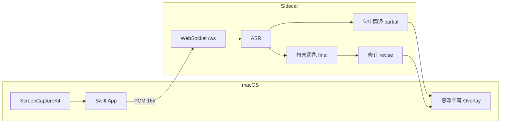

# 架构

## 数据流

## 两层配置

| 类型 | 存储 | 用途 |
|------|------|------|
| API 密钥 | `.env` | 实际调用各厂商 |
| UI 隐藏偏好 | `cloud-ui.json` + UserDefaults | 卡片显示与启动测试过滤 |

开发模式数据目录为**仓库根**（同时存在 `run.sh` 与 `server/main.py`）。  
App 模式为 `~/Library/Application Support/VoiceBridgeAI/`。

## 引擎三层

1. **ASR** — Whisper（本地）/ 腾讯 / OpenAI
2. **句中翻译** — partial provider（TMT、百度、Argos 等）
3. **句末润色** — final provider（LLM 或同 partial）

本地模型默认须在 App 内下载（`VOICEBRIDGE_OPTIONAL_LOCAL_MODELS=1` 时可跳过预装检查）。

## 分支

- `main`（或当前默认）：macOS App + Python sidecar
- `legacy/web-only`：仅浏览器版备份，不参与 App 打包
