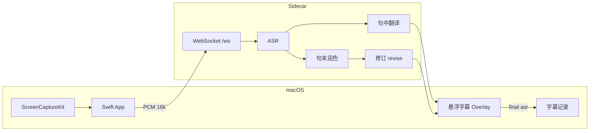

# 架构

## 数据流



## 配置分层

| 类型 | 存储 | 用途 |
|------|------|------|
| API 密钥 | `.env` | 厂商调用 |
| UI 隐藏 | `cloud-ui.json` + UserDefaults | 卡片显示 |
| 字幕 UI | UserDefaults | 透明度、英文显示 |
| 字幕记录 | UserDefaults | 目录、模板、形式、记录开关 |

**开发模式**：数据在仓库根（须同时存在 `run.sh` 与 `server/main.py`）。  
**App 模式**：`~/Library/Application Support/VoiceBridgeAI{,-Cloud,-Local}/` 或 Windows `%APPDATA%\VoiceBridgeAI{,-Cloud,-Local}\`（由 `BundleVariant` / `VOICEBRIDGE_BUNDLE_VARIANT` 区分）。

客户端偏好：macOS 用 UserDefaults；Windows 用 App 数据目录下 `overlay-prefs.json`、`transcript-prefs.json`。

## 引擎三层

1. **ASR** — Whisper（本地）/ 腾讯 / OpenAI  
2. **句中翻译** — TMT、百度、Argos 等  
3. **句末润色** — LLM 或同 partial  

润色提示在 `server/core/llm_compat.py`，按 **观看场景** 追加 `polishHint`（`revise_config.py`）。

## 观看场景

| 模式 | 静音切句 | 单段最长 | 润色侧重 |
|------|----------|----------|----------|
| 演讲 speech | ~1.0s | 14s | 口语节奏 |
| 技术 tech | ~0.9s | 18s | 术语一致 |
| 会议 conference | ~0.6s | 10s | 短句直译 |
| 网课 course | ~1.5s | 22s | 知识点整段 |

`REVISE_MODE` 与设置页同步；旧值 `balanced`/`speed`/`accuracy` 映射为 speech/conference/course。

## Python 侧车

```
main.py → app_bootstrap.create_app() → routes/*
```

| routes | 职责 |
|--------|------|
| `health.py` | 健康检查 |
| `models_local.py` | 本地模型（cloud 变体禁用下载） |
| `cloud.py` | 云端密钥 |
| `engine.py` | 引擎设置 |
| `ws.py` | PCM 会话 |

`config/bundle_variant.py`：区分 cloud / local App，local 可指向 `bundled-models/` 内 Argos 包路径。

## macOS 模块要点

| 机制 | 实现 |
|------|------|
| 侧车启动 | `SidecarLaunch` → bundled `run-server.sh` 或 dev `run.sh` |
| 显示 2 行 | `SubtitleStore` |
| 暂停清空 | `PcmSilenceMonitor` ~2.5s |
| 记录定稿 | `TranslationRecorder` + `TranscriptPreferences` |
| 云端版 UI | `BundleVariant` 隐藏本地模型 Tab |

## Windows 模块要点

| 机制 | 实现 |
|------|------|
| 系统音频 | WASAPI loopback（`SystemAudioCapture` / NAudio） |
| 侧车启动 | `ServerManager` → `run-server.ps1` 或 dev 根目录 `run.ps1` |
| 悬浮 UI | `OverlayWindow` + `OverlayPreferences` |
| 设置 | `SettingsWindow`（引擎 / 本地模型 / 字幕记录 / 接口密钥） |
| 托盘 | `TrayController` |
| 记录定稿 | `TranslationRecorder` + `TranscriptPreferences`（同 macOS 逻辑） |

详见 [desktop/windows/README.md](../desktop/windows/README.md)。

## 本地模型存储

| 模型 | 标记 | 数据 |
|------|------|------|
| Whisper | `models/whisper/.installed-{规格}` | `models/hf/hub/` |
| Argos | `models/argos/.installed-en-zh` | Argos packages 目录 |

`VOICEBRIDGE_OPTIONAL_LOCAL_MODELS=0` 表示预装/强制模式（local App 默认）；`=1` 为可选下载模式（开发默认）。

## 分支

| 分支 | 说明 |
|------|------|
| `main` | macOS App + Python 侧车（当前） |
| `feat/winapp` | Windows WinUI 客户端（与 main 并行开发） |
| `legacy/web-only` | 浏览器版备份 |
| `feat/chrome-extension` | Chrome 扩展实验 |
