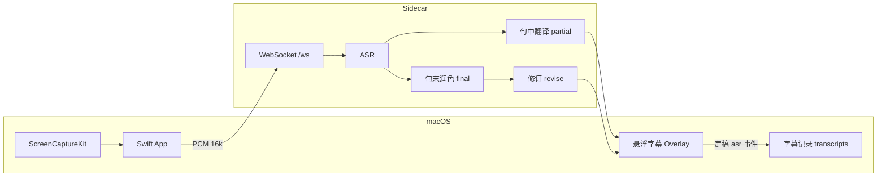

# 架构

## 数据流



## 两层配置

| 类型 | 存储 | 用途 |
|------|------|------|
| API 密钥 | `.env` | 实际调用各厂商 |
| UI 隐藏偏好 | `cloud-ui.json` + UserDefaults | 卡片显示与启动测试过滤 |
| 字幕 UI 偏好 | UserDefaults | 透明度、英文显示、记录开关 |
| 字幕记录偏好 | UserDefaults | 目录、文件名模板、内容形式 |

开发模式数据目录为**仓库根**（同时存在 `run.sh` 与 `server/main.py`）。  
App 模式为 `~/Library/Application Support/VoiceBridgeAI/`。

## 引擎三层

1. **ASR** — Whisper（本地）/ 腾讯 / OpenAI
2. **句中翻译** — partial provider（TMT、百度、Argos 等）
3. **句末润色** — final provider（LLM 或同 partial）

LLM 句末润色提示（`server/core/llm_compat.py`）面向悬浮字幕，并按当前**观看场景**追加 `polishHint`（定义于 `revise_config.py`）。有句中草稿时在其基础上润色；只要求模型输出译文。

## 观看场景（断句 + 润色）

App **设置 → 引擎** 或 **主窗口** 选择预设，影响：

- **断句**：本地 Whisper / OpenAI 的静音 VAD；腾讯云由云端 VAD 切句
- **润色**：句末 LLM 按场景调整译文风格（`server/config/revise_config.py` 中 `polishHint`）

| 模式 | 适用 | 静音切句 | 单段最长 | 润色侧重 |
|------|------|----------|----------|----------|
| 演讲 | keynote、发布会 | ~1.0s | 14s | 口语有节奏 |
| 技术分享 | Meetup、架构讲解 | ~0.9s | 18s | 术语一致 |
| 会议 | 峰会 Q&A、多人轮替 | ~0.6s | 10s | 短句直译 |
| 网课 | MOOC、培训录播 | ~1.5s | 22s | 知识点整段 |

配置项 `REVISE_MODE`（`.env`）与引擎页保存同步。旧值 `balanced` / `speed` / `accuracy` 分别映射为演讲 / 会议 / 网课。

本地模型默认须在 App 内下载（`VOICEBRIDGE_OPTIONAL_LOCAL_MODELS=1` 时可跳过预装检查）。

## Python 侧车结构

```
main.py → app_bootstrap.create_app() → routes/*
```

WebSocket 会话在 `routes/ws.py`：接收 PCM 与 config，驱动 VAD 断句、ASR、revise 调度，推送 `type: asr` JSON 至 Swift。

## macOS 字幕 UX

| 机制 | 实现 |
|------|------|
| 显示 2 行 | `SubtitleStore` 保留最近 2 个 segment |
| 暂停清空 | `PcmSilenceMonitor` ~2.5s + 无 ASR 8s 兜底 |
| 记录定稿 | `TranslationRecorder` 仅 `final: true` |
| 格式转换 | `TranscriptParser` / `TranscriptRenderer` |

## 分支

- `main` / `feat/macapp`：macOS App + Python sidecar（当前默认）
- `legacy/web-only`：浏览器版备份
- `feat/chrome-extension`：Chrome 扩展实验（其它分支）

## 本地模型存储

| 模型 | 标记文件 | 数据 |
|------|----------|------|
| Whisper | `models/whisper/.installed-{规格}` | `models/hf/hub/`（HF 缓存） |
| Argos | `models/argos/.installed-en-zh` | Argos 包目录 |

可选模式下以 marker 为准判断 App 内「已安装」；删除时同步清理缓存并刷新 Argos 语言列表。
