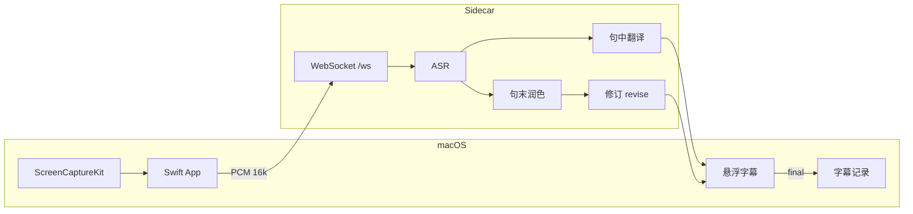

# 架构

## 数据流

## 引擎三层

1. **ASR** — Whisper（本地）/ 腾讯 / OpenAI
2. **句中翻译** — TMT、百度、Argos 等
3. **句末润色** — LLM 或同 partial

润色提示在 `server/core/llm_compat.py`，按 **观看场景** 追加 `polishHint`（`revise_config.py`）。

## 观看场景

| 模式 | 静音切句 | 单段最长 | 润色侧重 |
|------|----------|----------|----------|
| 演讲 speech | ~1.0s | 14s | 口语节奏 |
| 技术 tech | ~0.9s | 18s | 术语一致 |
| 会议 conference | ~0.6s | 10s | 短句直译 |
| 网课 course | ~1.5s | 22s | 知识点整段 |

`REVISE_MODE` 与设置页同步。

## 配置分层

| 类型 | 存储 | 用途 |
|------|------|------|
| API 密钥 | `.env` | 厂商调用 |
| UI 隐藏 | `cloud-ui.json` + UserDefaults | 卡片显示 |
| 字幕 UI | UserDefaults | 透明度、英文显示 |
| 字幕记录 | UserDefaults | 目录、模板、形式 |

**开发模式**：数据在仓库根。**App 模式**：`~/Library/Application Support/VoiceBridgeAI{,-Cloud,-Local}/`。

## Python 侧车

`main.py` → `app_bootstrap.create_app()` → `routes/*`

| routes | 职责 |
|--------|------|
| `health.py` | 健康检查 |
| `models_local.py` | 本地模型（cloud 变体禁用下载） |
| `cloud.py` | 云端密钥 |
| `engine.py` | 引擎设置 |
| `ws.py` | PCM 会话 |

## macOS 要点

| 机制 | 实现 |
|------|------|
| 侧车启动 | `SidecarLaunch` → `run-server.sh` 或 dev `run.sh` |
| 暂停清空 | `PcmSilenceMonitor` ~2.5s |
| 记录定稿 | `TranslationRecorder` |
| App 变体 | `BundleVariant`：cloud 隐藏本地模型 Tab |

## 本地模型

| 模型 | 标记 | 数据 |
|------|------|------|
| Whisper | `models/whisper/.installed-{规格}` | `models/hf/hub/` |
| Argos | `models/argos/.installed-en-zh` | Argos packages |

Local App 默认预装（`VOICEBRIDGE_OPTIONAL_LOCAL_MODELS=0`）；开发模式可选下载（`=1`）。
